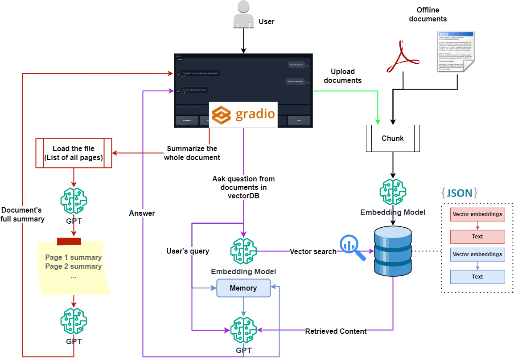
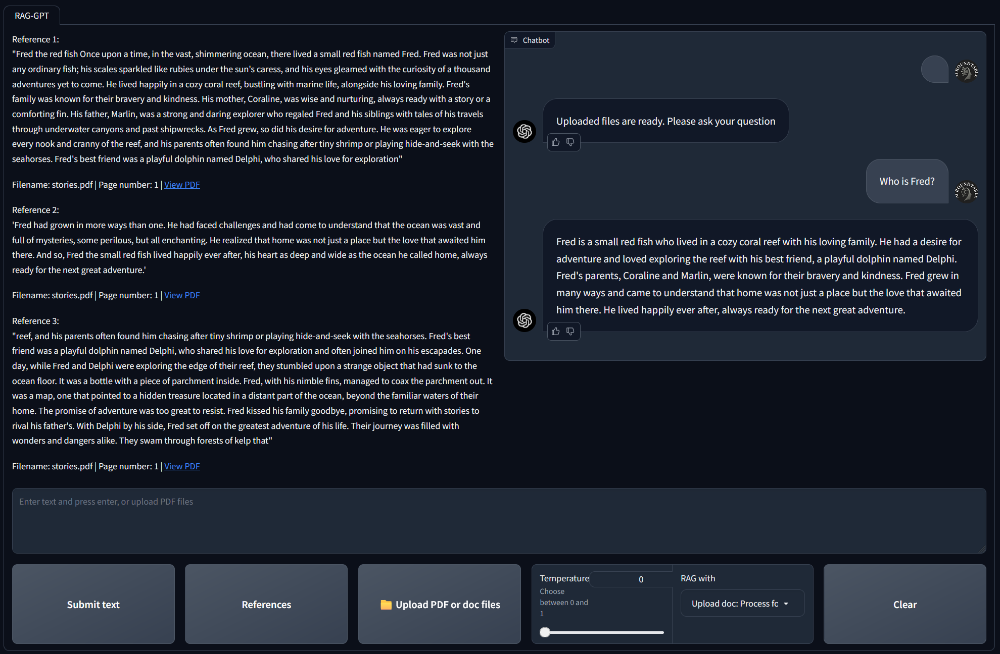

---

# CONVO_FORGE_PDF: AI-Powered PDF Interaction Chatbot

Welcome to CONVO_FORGE_PDF, The MultiPDF Chat App is a Python application that allows you to chat with multiple PDF documents. You can ask questions about the PDFs using natural language, and the application will provide relevant responses based on the content of the documents. This app utilizes a language model to generate accurate answers to your queries. Please note that the app will only respond to questions related to the loaded PDFs.

## Table of Contents

- [Introduction](#introduction)
- [How It Works](#how-it-works)
- [Key Technologies](#key-technologies)
- [Dependencies and Installation](#dependencies-and-installation)
- [Usage](#usage)
- [Contributing](#contributing)
- [License](#license)

## Introduction

CONVO_FORGE_PDF is a versatile application that can scrape content from PDFs and provide interactive chat functionality. Here's how it works:

## How It Works

The application follows these steps to provide responses to your questions:

1. **Data Loading:** The app reads data from PDF content and processes it using custom logic.
2. **Text Chunking:** The extracted text is divided into smaller chunks for efficient processing.
3. **Language Model:** The application uses the Voyage AI embedding model to generate vector representations (embeddings) of the text chunks.
4. **Vector Storage:** FAISS is used to store and manage these vector embeddings efficiently.
5. **Similarity Matching:** When you ask a question, the app compares it with the text chunks and identifies the most semantically similar ones using FAISS.
6. **Response Generation:** The selected chunks are passed to the GEMMA-7B model, which generates a response based on the relevant content.
7. **AI Interfacing:** Groq AI is used to optimize the interaction between these components, significantly reducing the retrieval and response generation time.



## CONVO_FORGE_PDF User-Interface


## Key Technologies

### Voyage AI Embedding Model
Voyage AI is used to convert text chunks into high-dimensional vector representations (embeddings). These embeddings capture the semantic meaning of the text, allowing the system to perform accurate similarity matching and retrieval.

### FAISS (Facebook AI Similarity Search)
FAISS is a library developed by Facebook AI Research for efficient similarity search and clustering of dense vectors. It is highly optimized for performance and can handle large-scale datasets, making it ideal for storing and querying the embeddings generated by the Voyage AI model.

### GEMMA-7B
GEMMA-7B is a powerful text generation model used to generate coherent and contextually relevant responses based on the retrieved information. It ensures that the chatbot's responses are natural and informative.

### Groq AI
Groq AI provides the interfacing and optimization layer for the AI components in the system. It handles the integration of different AI models and technologies, optimizing their interactions to minimize latency and maximize throughput. This interfacing is one of the main highlights of CONVO_FORGE_PDF, as it significantly compresses the retrieval time, allowing for faster and more efficient responses.

### Custom Logic
Custom algorithms and heuristics are employed to process the scraped data, ensuring accurate and contextually relevant information extraction.

### Langchain
Langchain integrates natural language processing and vector storage technologies to enhance the chatbot's conversational capabilities. It ensures seamless interaction between the different components of the application.

### Gradio
Gradio provides an intuitive user interface for interacting with the chatbot. It allows users to easily engage with the application and upload documents in real-time.

## Dependencies and Installation

To install CONVO_FORGE_PDF, please follow these steps:

1. Clone the repository to your local machine:

   ```bash
   git clone https://github.com/yourusername/CONVO_FORGE_PDF.git
   cd CONVO_FORGE_PDF
   ```

2. Start a virtual environment. Use the appropriate command based on your operating system:
   - **Windows:**
     ```bash
     python -m venv venv
     .\venv\Scripts\activate
     ```
   - **Linux:**
     ```bash
     python3 -m venv venv
     source venv/bin/activate
     ```

3. Install the required dependencies by running the following command:

   ```bash
   pip install -r requirements.txt
   ```

Certainly! Here is the updated chunk with the correct API key information:

---

4. Obtain API keys from Voyage AI, Groq AI, and Google:

   - Sign up at [Voyage AI](https://dash.voyageai.com/) and obtain your API key.
   - Sign up at [Groq AI](https://console.groq.com/playground) and obtain your API key.
   - Sign up at [Google AI](https://ai.google.dev/aistudio) and obtain your API key.

5. Create a `.env` file in the project directory and add your API keys:

   ```plaintext
   VOYAGE_API_KEY = "your-voyage-api-key"
   GROQ_API_KEY = "your-groq-api-key"
   GOOGLE_API_KEY = "your-google-api-key"
   ```


## Usage

To use CONVO_FORGE_PDF, follow these steps:

1. Ensure that you have installed the required dependencies and added the API keys to the `.env` file.

2. Run the `app.py` file to scrape the website. Execute the following command:

   ```bash
   python app.py
   ```


3. The application will launch in your default web browser, displaying the user interface.

4. Ask questions in natural language using the chat interface.

## Contributing

This repository is intended for educational purposes and does not accept further contributions. Feel free to utilize and enhance the app based on your own requirements.

## License

CONVO_FORGE_PDF is released under the MIT License.

---
